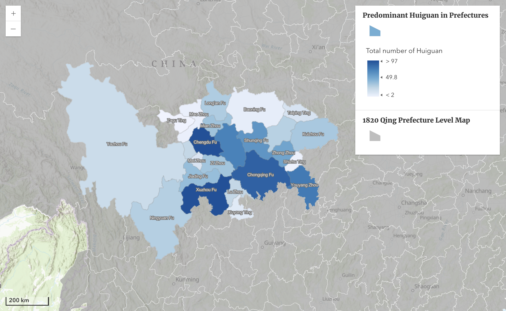
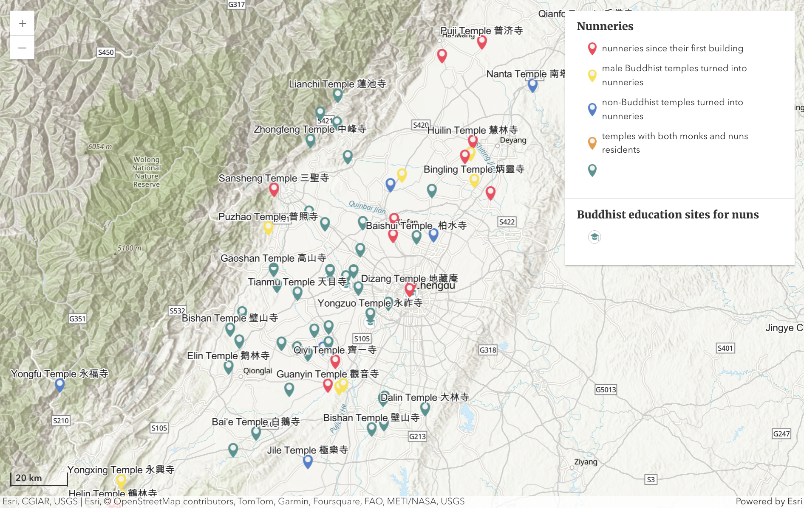
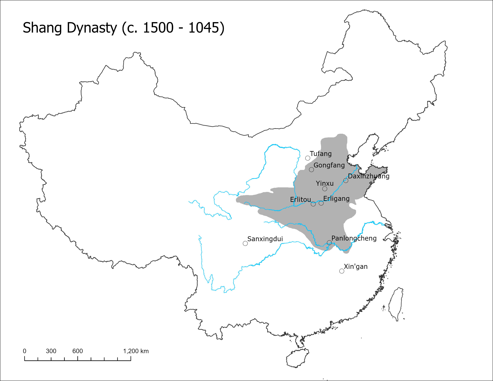
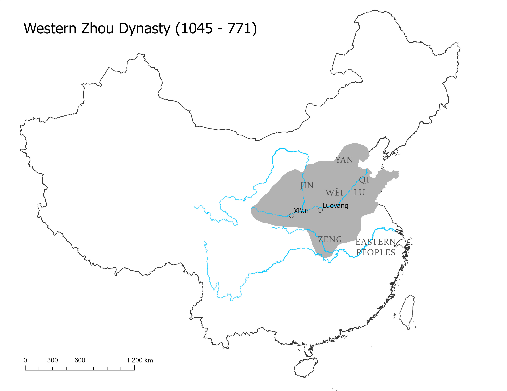
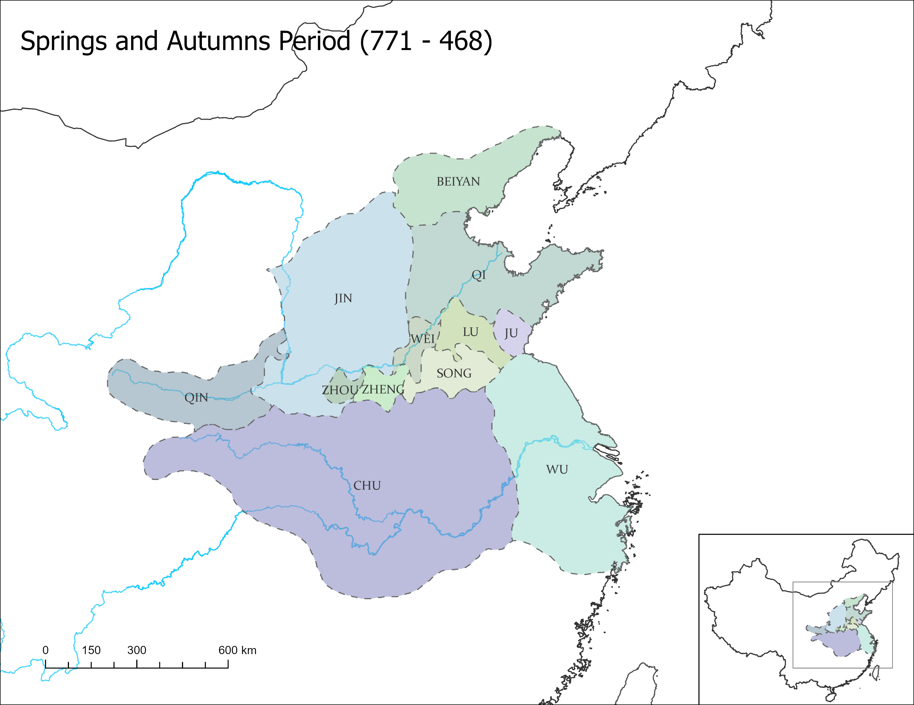
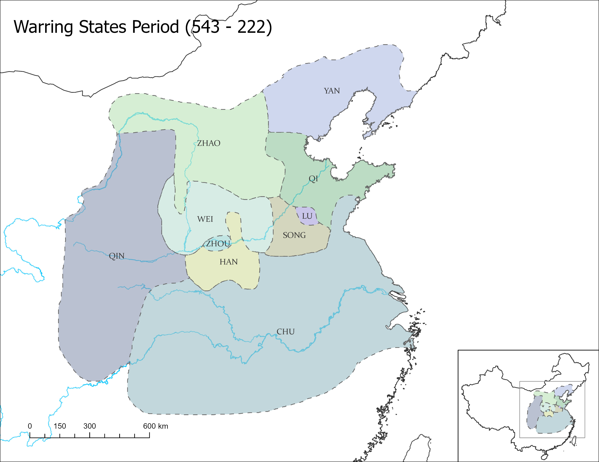

# Digital Humanities and Computational Archaeology

My work in Digital Humanities and Computational Archaeology spans three primary areas: **Geospatial Data Visualization** using ArcGIS Online and JavaScript, **Computational Analysis** such as statistics, PCA, and SNA in R, and **Machine Learning and Deep Learning** in Python for archaeological applications.

All my code is open-source and available on my [Github](https://github.com/ywzhou997), with some projects presented as tutorials to facilitate learning and replication.

 
## Mapping Religious Diversity in Modern Sichuan
Co-directed by Dr. Elena Valussi at Loyola University and Dr. Stefania Travagnin from SOAS, this project aims to study religious diversity in Southwestern China through the analysis of communities and networks. It is specifically interested in interactions between rural/urban, public/private, and religious/lay communities and spaces. My role in this project includes managing, analyzing, and visualizing geospatial data. Read more on the [project website](https://sichuanreligions.com/).

Project Map|  Huiguan Map  | Nunnery Map
:-------------------------:|:-------------------------:|:-------------------------:
  |  | 

 
-----
 

## Maps in _A Brief History of Ancient China_
I contributed to the production of all the maps featured in [_A Brief History of Ancient China_](https://www.bloomsbury.com/us/brief-history-of-ancient-china-9781350170377/), authored by Professor Edward L. Shaughnessy. This work involved extensive geospatial data entry, cartographic design, and visualization to support the book's research and narrative.

  |   
:-------------------------:|:-------------------------:
 | 

 

